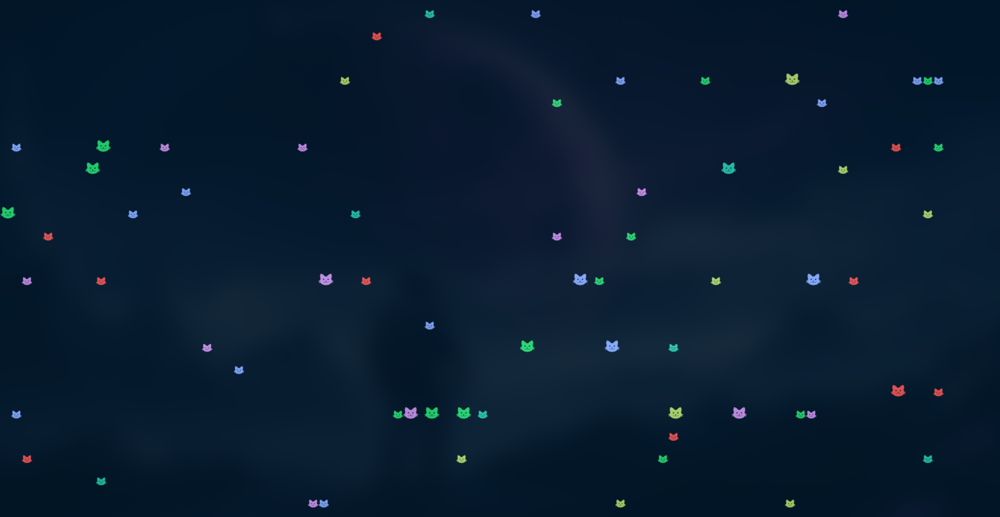

# This repository contains a C program that simulates raining of colorful unicode/glyph cats:




## To implement the code, make sure `gcc`,`ncurses`,`nerd-fonts-jetbrains-mono`(or any nerd font of your choice) are installed.

```shell
#on arch:
sudo pacman -S nerd-fonts-jetbrains-mono gcc ncurses
```
## To clone this repo:

```shell
git clone https://github.com/Dharani9018/Cat_Rain.git
```
## compile the code:
```shell
gcc -o catrain Cat_Rain.c -lncurses
```
## Execute 
```shell
catrain
```

## Add this line to your shell config file `~/.bashrc` or `~/.zshrc`
```shell
alias catrain  'Replace_with_Your_binary_file_path/catrain'.
```

Thank you.


